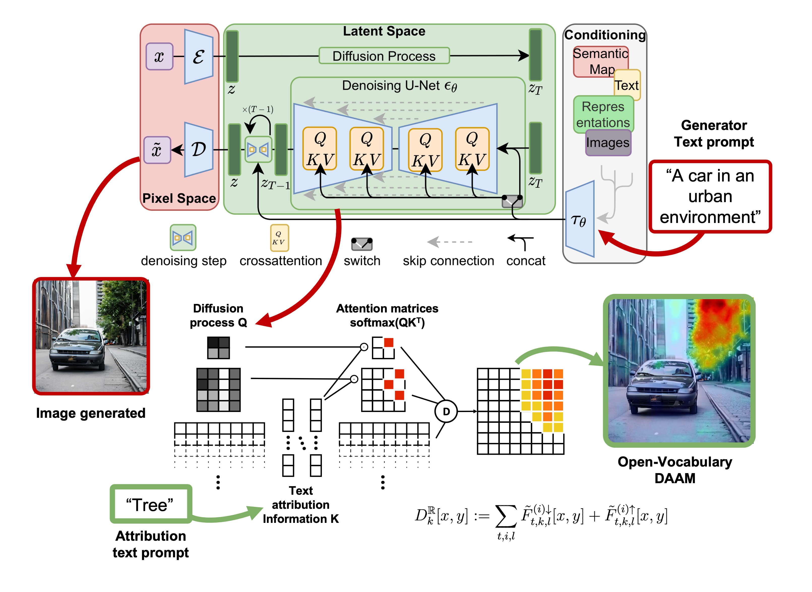
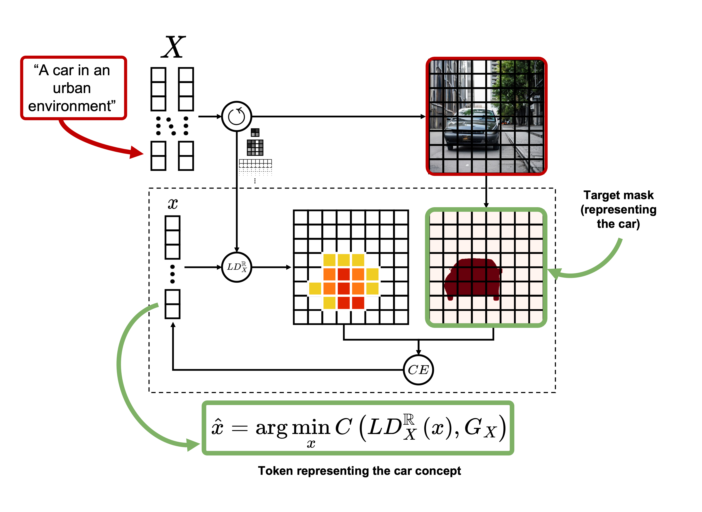

# Synthetic data generation using Latent Diffusion Models for Semantic Segmentation of Urban Scenes

This repository contains the work done to complete the Master in Deep Learning for Audio and Video Signal Processing at the Universidad Autónoma de Madrid.

**Author**: [@pablomm](https://github.com/pablomm/)

**Advisor**: [@jcsma](https://github.com/jcsma)

| [Document](./Master%20Thesis.pdf) | [Presentation](./Presentation.pdf) |

## TL;DR

We extend [DAAM](https://github.com/castorini/daam), a method for attributing the influence of words that have generated an image in Stable Diffusion. The proposed extension, Open-Vocabulary DAAM, allows to generate attribution maps for any word, whether or not it is present in the text prompt.

And we explore the use of this extension for concept extraction, optimizing the token to maximize attention within an area.

## Abstract

This master’s thesis investigates the use of text-to-image Latent Diffusion Models (LDM) for generating synthetic datasets in semantic segmentation tasks. Specifically, it focuses on their application in urban scenarios, where the scarcity of annotated data motivates the use of synthetic data.

The research centers around Diffusion Attentive Attribution Maps (DAAM), an existing explainability method used to attribute the influence of each part of a text prompt to regions in a generated image produced by an LDM.

Two extensions of DAAM are proposed. Firstly, “Open Vocabulary DAAM” is introduced, enabling the construction of attribution maps for arbitrary texts, regardless of whether they were used as prompts for generating the synthetic images. Secondly, “Linear DAAM” is presented as a simplified version that facilitates the generation of attribution maps for individual words. These modifications facilitate the use of this method for object segmentation based on semantic descriptions.

To address the challenge of selecting the most appropriate word to semantically describe an object, an optimization strategy in the text-embedding space is proposed. This approach aims to identify the most accurate words for describing target regions, thereby enhancing the precision of segmentation masks.

To validate the proposed methodology, a series of experiments were conducted on a dataset generated using Stable Diffusion. The results confirm the effectiveness of optimized tokens in segmenting objects across diverse images, thereby emphasizing the valuable semantic information contained within these tokens.

This work contributes to the research problem in two main aspects. Firstly, it deepens the explainability of LDMs through the development of “Open Vocabulary DAAM,” a tool with the potential to analyze learned semantic relationships, potential biases, and synthesis mechanisms. Secondly, it advances research on Open Vocabulary- based segmentation models by proposing a strategy for searching descriptive words for an object, resulting in improved segmentation masks without the need for model retraining.

Although these findings are preliminary, they strongly highlight the potential of attention maps in object segmentation. Moreover, they provide a solid foundation for future research in this field.

## Code

A more extended version of the code to reproduce this work can be found at [https://github.com/vpulab/ovam](https://github.com/vpulab/ovam).
